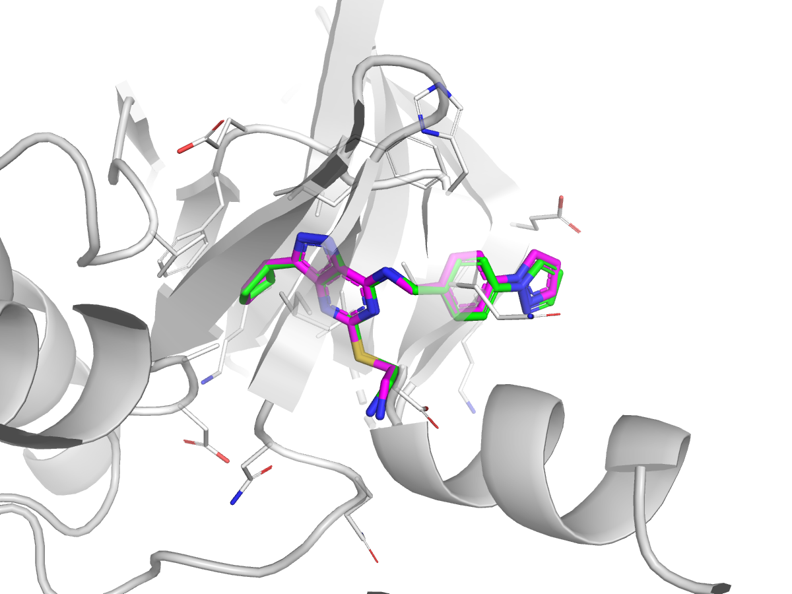
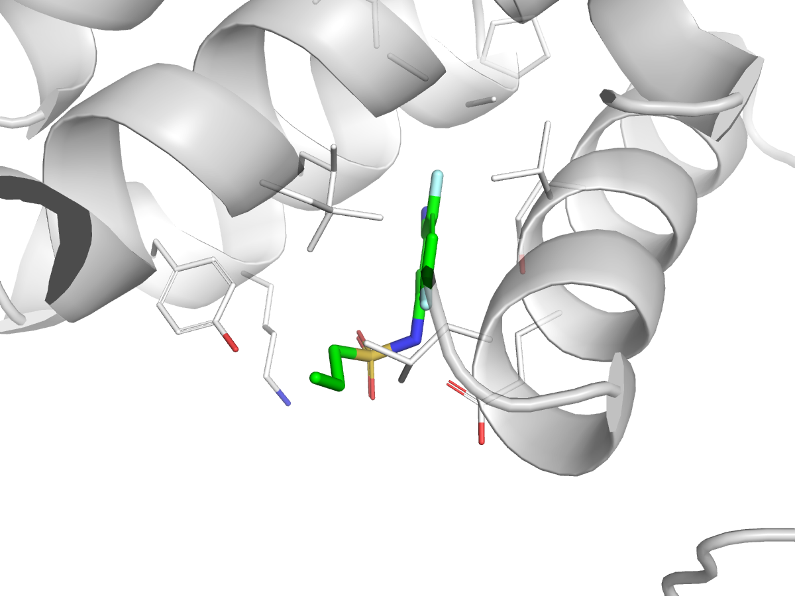
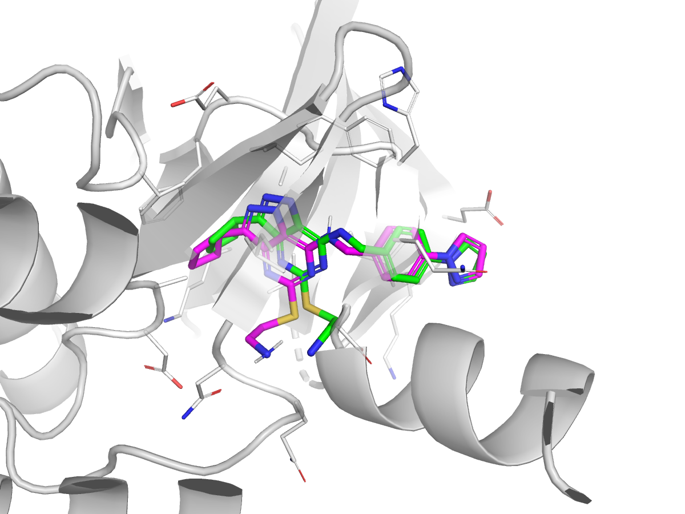
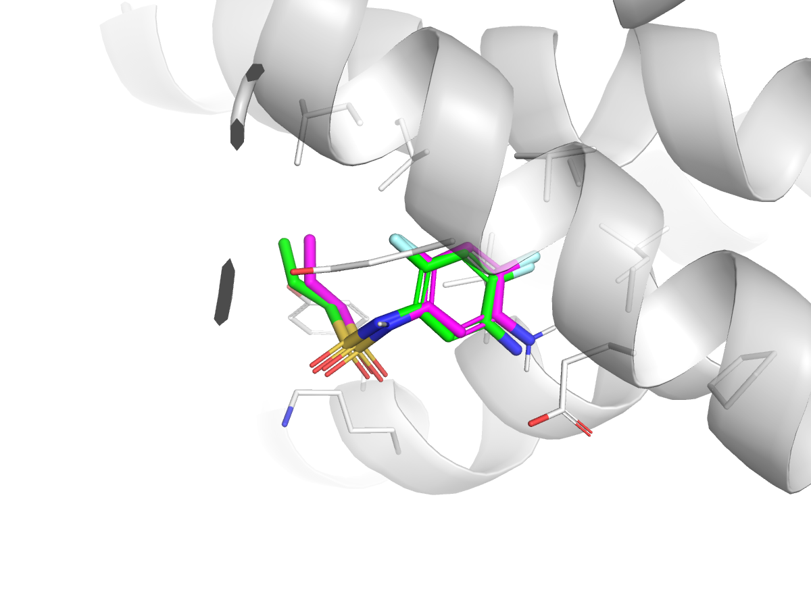

# dockStrat


A benchmarking framework for protein-ligand docking methods evaluated against experimental crystal structures.

---

## Motivation

The [runs-n-poses](https://github.com/plinder-org/runs-n-poses) benchmark demonstrated that co-folding models show a pronounced performance gap when stratified by ligand similarity to training data. This project extends that observation by **systematically comparing co-folding, physics-based, and hybrid rescoring methods on the same stratified benchmark**, and by analyzing how system properties (receptor size, ligand flexibility, binding-site characteristics) drive the differences between paradigms.

Key findings: co-folding models deteriorate to **25–40% success rates on novel systems** (consistent with memorization), while physics-based and hybrid methods maintain **>60% success rates** out-of-distribution — highlighting the complementarity of the two approaches for drug discovery applications.

**Benchmark datasets:**

| Dataset | Systems | Source |
|---------|---------|--------|
| runsNposes | ~1,280 | [runs-n-poses](https://github.com/plinder-org/runs-n-poses) — primary benchmark |
| Plinder test set | ~1,038 | [plinder](https://www.plinder.sh/) — secondary validation |

---

## Similarity Stratification

To measure generalizability, each test system is assigned a similarity score to pre-2021 training data using a composite metric:

**SuCOS** (Shape + Pharmacophore) = 50% pharmacophore feature overlap + 50% 3D shape overlap, weighted by **pocket query coverage** (fraction of the binding pocket that matches known pockets). The final metric (`sucos_shape_pocket_qcov`, 0–100%) captures both ligand-level and pocket-level novelty.

Systems are binned into 8 strata (0–20%, 20–30%, ..., 80–100%) and success rates computed per bin. This reveals how each method degrades on increasingly novel targets — co-folding models show steep drop-offs (58–72 pp gap between highest and lowest bins), while physics-based methods maintain flatter profiles.

The similarity scoring pipeline is implemented in `notebooks/runs-n-poses/similarity_scoring.py` using RDKit's `FeatMaps` (pharmacophore) and `ShapeProtrudeDist` (shape) with Crippen O3A pre-alignment.

---

## Supported Methods & Benchmark Results

Results below are RMSD < 2 Å success rates on the **runsNposes** benchmark, stratified by SuCOS similarity to pre-2021 training data (Xu et al., *A Multi-Paradigm Benchmark of Molecular Docking*).

| Category | Method | Success 0–20% (%) | Success 80–100% (%) | Gap Δ (pp) |
|----------|--------|-------------------|---------------------|------------|
| Reference  | Best Possible | 89 | 100 | +11 |
| Co-folding | AlphaFold3    | 38 |  96 | +58 |
| Co-folding | Boltz-1       | 22 |  94 | +72 |
| Co-folding | Chai-1        | 25 |  94 | +69 |
| Co-folding | Protenix      | 27 |  92 | +65 |
| Hybrid     | GNINA         | 62 |  89 | +27 |
| Hybrid     | ICM-RTCNN     | 67 |  79 | +12 |
| Physics    | ICM           | 53 |  71 | +18 |
| Physics    | Vina          | 18 |  31 | +13 |
| Physics    | Uni-Dock      | 12 |  27 | +15 |

The **generalization gap (Δ)** is the success-rate difference between the highest- and lowest-similarity bins. Co-folding models show 58–72 pp gaps (memorization-sensitive); hybrid and physics methods are more OOD-robust. Boltz-2 is implemented in this repo but excluded from the table because its training set overlaps the test set.

### Pose Comparison: Co-folding vs Hybrid in Two Similarity Regimes

Predicted poses (magenta sticks) overlaid on the crystal ligand (green sticks) and receptor (grey cartoon) for one **high-similarity** target (`7qhl__1__1.A__1.E`, SuCOS = 85.2) and one **low-similarity** target (`8cfb__1__1.A__1.L`, SuCOS = 3.0). Binding-pocket residues within 5 Å of the crystal ligand are drawn as thin white sticks for context. AF3's predicted protein is aligned to the crystal receptor before showing only its ligand; panels are framed on the native binding pocket, so AF3's low-sim pose is off-screen (placed ≈38 Å away, see caption below).

| | High similarity (SuCOS 85.2) | Low similarity (SuCOS 3.0) |
|---|---|---|
| **AF3** (co-folding) |  <br> RMSD = 0.19 Å (success) |  <br> RMSD = 37.8 Å (hallucinated, far from pocket) |
| **GNINA** (hybrid) |  <br> RMSD = 1.42 Å (success) |  <br> RMSD = 0.44 Å (success) |

At high similarity both paradigms recover the native pose. At low similarity AF3 places the ligand far outside the binding site (RMSD ≈ 38 Å) while GNINA's physics-based sampling still locks into the correct pose (RMSD < 0.5 Å). This is the contrast quantified by the generalization gap in Table 1.

The figures were generated with `scripts/generate_pose_comparison_figure.py`; see `docs/figures/selection_metadata.json` for the exact selection criteria.

---

**Conda environments by method:**

Each supported method has an idempotent install script under `scripts/install_{method}_env.sh`. Running it creates the env at `/mnt/katritch_lab2/aoxu/envs/{method}` and symlinks `envs/{method}` from the project root.

| Method | Install script | Env path (after install) |
|--------|----------------|--------------------------|
| `alphafold3` | `scripts/install_alphafold3_env.sh` | `envs/alphafold3/` |
| `protenix`   | `scripts/install_protenix_env.sh`   | `envs/protenix/` |
| `boltz1`/`boltz2` | `scripts/install_boltz_env.sh` | `envs/boltz/` |
| `chai`       | `scripts/install_chai_env.sh`       | `envs/chai/` |
| `vina`       | `scripts/install_vina_env.sh`       | `envs/vina/` |
| `gnina`      | `scripts/install_gnina_env.sh`      | `envs/gnina/` (wraps `forks/GNINA/`) |
| `dynamicbind`| `scripts/install_dynamicbind_env.sh`| `envs/dynamicbind/` (wraps `forks/DynamicBind/`) |
| `unidock2`   | `scripts/install_unidock2_env.sh`   | `envs/unidock2/` |
| `surfdock`   | `scripts/install_surfdock_env.sh`   | `envs/surfdock/` |
| `icm`        | — | physics-based; uses commercial ICM binary on `$PATH` |

---

## Installation & Quickstart

### 1. Install the package

```bash
cd /path/to/dockStrat
conda create -n dockstrat python=3.10 -y
conda activate dockstrat
pip install -e .
```

### 2. Configure environment variables

```bash
cp .env.example .env
# edit .env with paths for the methods you want to use
set -a && source .env && set +a
```

### 3. Run docking

```python
from dockstrat import dock_engine

# Single molecule
result = dock_engine(
    'vina',
    protein='receptor.pdb',
    ligand='ligand.sdf',
    output_dir='./results',
)

# Full runsNposes benchmark
dock_engine('gnina', dataset='runsNposes')
dock_engine('gnina', dataset='runsNposes', repeat_index=1)
```

Poses are written as ranked SDF files under `results/`. See `CLAUDE.md` for per-method setup details and the full `dock_engine` API.

### 4. Compute RMSD

**Physics-based methods** (Vina, GNINA, UniDock2, ICM) dock the ligand into the crystal receptor frame, so direct symmetry-corrected RMSD works:

```python
from rdkit import Chem
from rdkit.Chem.rdMolAlign import CalcRMS

ref  = Chem.MolFromMolFile('crystal_ligand.sdf', removeHs=True)
pose = Chem.MolFromMolFile('rank1.sdf', removeHs=True)
rmsd = CalcRMS(ref, pose)  # symmetry-corrected
```

**Co-folding methods** (AlphaFold3, Boltz, Chai, Protenix) predict the entire complex in an arbitrary coordinate frame. The predicted protein must first be **superimposed onto the crystal receptor**, then ligand RMSD is measured. The benchmark uses [OpenStructure](https://openstructure.org/) `ost compare-ligand-structures` for this:

```bash
ost compare-ligand-structures \
    -m predicted_complex.cif \      # co-folding model output
    -r crystal_receptor.cif \       # reference receptor
    -rl crystal_ligand.sdf \        # reference ligand(s)
    -o results.json \
    --lddt-pli --rmsd --lddt-pli-amc
```

This aligns the predicted protein to the reference, then reports ligand RMSD, lDDT-PLI, and PoseBusters plausibility metrics in one step. See `notebooks/runs-n-poses/examples/utils/` for per-method analysis scripts.

---

## Project Structure

```
dockstrat/         # Python package -- dock_engine, per-method wrappers
  engine.py             # dock_engine unified entry point
  models/               # per-method inference modules (run_dataset, run_single)
  data/                 # input preparation and output extraction scripts
  analysis/             # RMSD, complex alignment, scoring
  utils/                # logging and data utilities

dockstrat_config/       # Hydra/OmegaConf YAML configs
  model/                # per-method inference configs

data/                   # benchmark datasets (crystal structures, not in git)
  runsNposes/           # primary benchmark
  plinder_set/          # secondary validation

envs/                   # symlinks to per-method conda envs (created by install scripts)
  alphafold3/, protenix/, boltz/, chai/, vina/, gnina/, ...

forks/                  # third-party codebases (submodules / local installs)
  alphafold3/           # AlphaFold3 source + weights
  GNINA/                # GNINA binary
  Vina/                 # AutoDock Vina + ADFR suite
  DynamicBind/          # DynamicBind diffusion docking
  chai-lab/             # Chai-1 source
  UniDock2/             # UniDock2
  SurfDock/             # SurfDock (code + weights; tools installed separately)
  ICM/                  # ICM docking scripts (commercial binary required)
  boltz/                # Boltz support files (input prep, extraction)

docs/figures/           # pose comparison figures for README
tests/                  # pytest suite (fast smoke tests + slow end-to-end)
```

---

## Citation

If you use dockStrat, please cite:

```bibtex
@article{xu2026multiparadigm,
  author  = {Xu, Ao and Lam, Jordy Homing and Nakano, Aiichiro and Katritch, Vsevolod},
  title   = {A Multi-Paradigm Benchmark of Molecular Docking: From Physics to Co-folding and Hybrid Models},
  year    = {2026},
  note    = {Data and code at \url{https://zenodo.org/records/16754298} and \url{https://github.com/AaronXu9/dockStrat}},
}
```

### Acknowledgements

Early development was seeded from the [PoseBench](https://github.com/BioinfoMachineLearning/PoseBench) codebase by Alex Morehead et al. (2024). The project has since been extensively rewritten for crystal-structure benchmarks.
